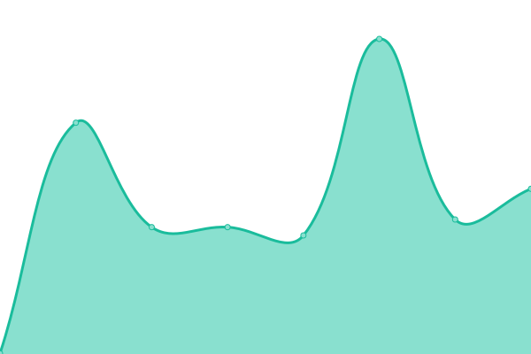

# [📈 Live Status](https://JonathanTreffler.github.io/status/): <!--live status--> **🟩 All systems operational**

This repository contains the open-source uptime monitor and status page for [Jonathan Treffler](jonathan-treffler.de), powered by [Upptime](https://github.com/upptime/upptime).

With [Upptime](https://upptime.js.org), you can get your own unlimited and free uptime monitor and status page, powered entirely by a GitHub repository. We use [Issues](https://github.com/JonathanTreffler/status/issues) as incident reports, [Actions](https://github.com/JonathanTreffler/status/actions) as uptime monitors, and [Pages](https://JonathanTreffler.github.io/status/) for the status page.

<!--start: status pages-->
<!-- This summary is generated by Upptime (https://github.com/upptime/upptime) -->
<!-- Do not edit this manually, your changes will be overwritten -->
<!-- prettier-ignore -->
| URL | Status | History | Response Time | Uptime |
| --- | ------ | ------- | ------------- | ------ |
|  [jonathan-treffler.de](https://jonathan-treffler.de) | 🟩 Up | [jonathan-treffler-de.yml](https://github.com/JonathanTreffler/status/commits/HEAD/history/jonathan-treffler-de.yml) | 

 263ms
     
 | 

<a href="https://JonathanTreffler.github.io/status/history/jonathan-treffler-de">100.00%</a>
    

|  [domspatzen-quantum.de](https://domspatzen-quantum.de) | 🟩 Up | [domspatzen-quantum-de.yml](https://github.com/JonathanTreffler/status/commits/HEAD/history/domspatzen-quantum-de.yml) | 

 309ms
     
 | 

<a href="https://JonathanTreffler.github.io/status/history/domspatzen-quantum-de">100.00%</a>
    

|  [Wann tritt Scheuer zurück](https://xn--wann-tritt-scheuer-zurck-htc.de/) | 🟩 Up | [wann-tritt-scheuer-zurueck.yml](https://github.com/JonathanTreffler/status/commits/HEAD/history/wann-tritt-scheuer-zurueck.yml) | 

 346ms
     
 | 

<a href="https://JonathanTreffler.github.io/status/history/wann-tritt-scheuer-zurueck">100.00%</a>
    

<!--end: status pages-->

[**Visit our status website →**](https://JonathanTreffler.github.io/status/)

## 📄 License

- Code: [MIT](./LICENSE) © [Jonathan Treffler](jonathan-treffler.de)
- Data in the `./history` directory: [Open Database License](https://opendatacommons.org/licenses/odbl/1-0/)
