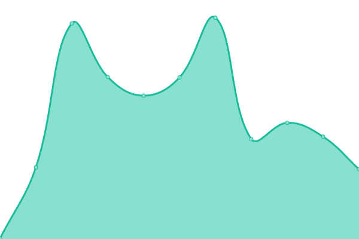

# [📈 Live Status](https://JonathanTreffler.github.io/status/): <!--live status--> **🟩 All systems operational**

This repository contains the open-source uptime monitor and status page for [Jonathan Treffler](jonathan-treffler.de), powered by [Upptime](https://github.com/upptime/upptime).

With [Upptime](https://upptime.js.org), you can get your own unlimited and free uptime monitor and status page, powered entirely by a GitHub repository. We use [Issues](https://github.com/JonathanTreffler/status/issues) as incident reports, [Actions](https://github.com/JonathanTreffler/status/actions) as uptime monitors, and [Pages](https://JonathanTreffler.github.io/status/) for the status page.

<!--start: status pages-->
| URL | Status | History | Response Time | Uptime |
| --- | ------ | ------- | ------------- | ------ |
| [jonathan-treffler.de](https://jonathan-treffler.de) | 🟩 Up | [jonathan-treffler-de.yml](https://github.com/JonathanTreffler/status/commits/master/history/jonathan-treffler-de.yml) |  193ms | 
| [domspatzen-quantum.de](https://domspatzen-quantum.de) | 🟩 Up | [domspatzen-quantum-de.yml](https://github.com/JonathanTreffler/status/commits/master/history/domspatzen-quantum-de.yml) |  215ms | 
<!--end: status pages-->

[**Visit our status website →**](https://JonathanTreffler.github.io/status/)

## 📄 License

- Code: [MIT](./LICENSE) © [Jonathan Treffler](jonathan-treffler.de)
- Data in the `./history` directory: [Open Database License](https://opendatacommons.org/licenses/odbl/1-0/)
